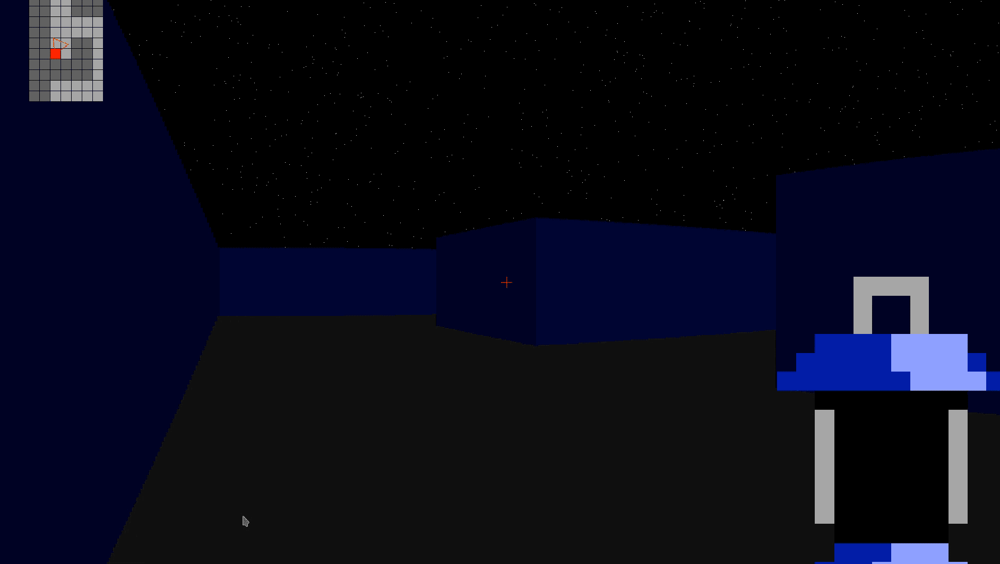

# Wolf 3D


Made with LibLapin (from Jason Brillante) (Updated to version 1.7, some mouse bugs can occur).

Screenshots available !



## Usage

```
./wolf3d file_name scope_name
```

Just run make and ./wolf3d ./levels/laby.ini laby

## Score

Moulinette : OK
Pitch : 33.5